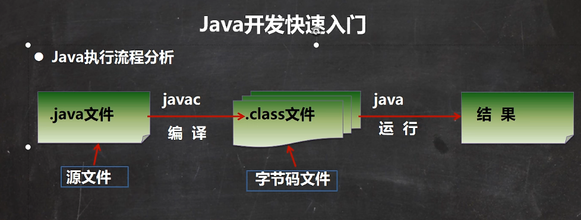
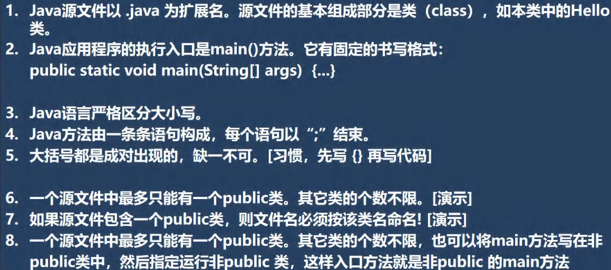
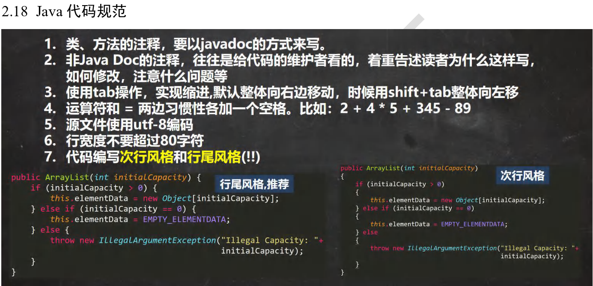

# Java 环境搭建

## Windows 系统


## 第一个 Java 程序
- [韩顺平Java_快速入门_哔哩哔哩_bilibili](https://www.bilibili.com/video/BV1fh411y7R8?p=17&vd_source=d5a7ff3d8b7fdfd220bc50a665e49ef9)
- [韩顺平Java_运行机制_哔哩哔哩_bilibili](https://www.bilibili.com/video/BV1fh411y7R8?p=18&vd_source=d5a7ff3d8b7fdfd220bc50a665e49ef9)

```java
//表示一个类hello
public class Hello {
    //编写一个main方法
    public static void main(String[] args) {
        System.out.println("韩顺平教育 hello");
    }
}
```

### 执行流程



### 注释
用于注解说明解释程序的文字就是注释，注释提高了代码的阅读性（可读性）；注释是一个程序员必须要具有的良 好编程习惯。

1. 单行注释
2. 多行注释
3. 文档注释
1) 单行注释 // 
2) 多行注释 /* */ 
```java
public class Comment {
    public static void main(String[] args) {
        //单行注释
        /* 这是多行注释
           下面实现两个数相加
           定义变量
           。。。
        */
        int n1 = 10;
        int n2 = 20;
        //求和
        int sum = n1 + n2;
        System.out.println("结果=" + sum);
    }
}

```

### Java 代码规范


