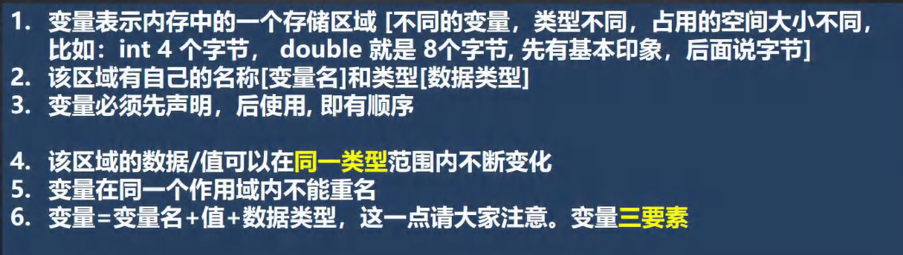
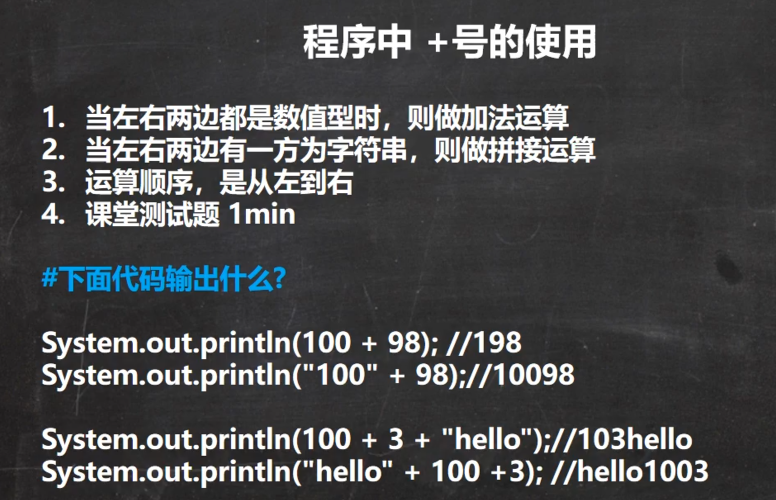

# 变量

- (P035 - P062) 0034_韩顺平Java_变量原理_哔哩哔哩_bilibili

变量相当于内存中一个数据存储空间的表示。

## 变量三个基本要素
- 类型
- 名称
- 值

## 变量使用步骤
1. 声明变量
   ```java
   int a;
   ```
2. 赋值
   ```java
   a = 60;   //把60赋值给a
   ```
3. 使用
   ```java
   System.out.println(a);
   ```

也可以一步到位（通常是一步完成）：
```java
int a = 60;
```

## 示例代码
```java
//表示一个类hello
public class Hello {
    //编写一个main方法
    public static void main(String[] args) {
        //声明变量
        int a;
        a = 100;
        System.out.println(a);

        //也可以一步到位
        int b = 200;
        System.out.println(b);
    }
}
```

## 变量使用注意事项


## 程序中 + 号使用
