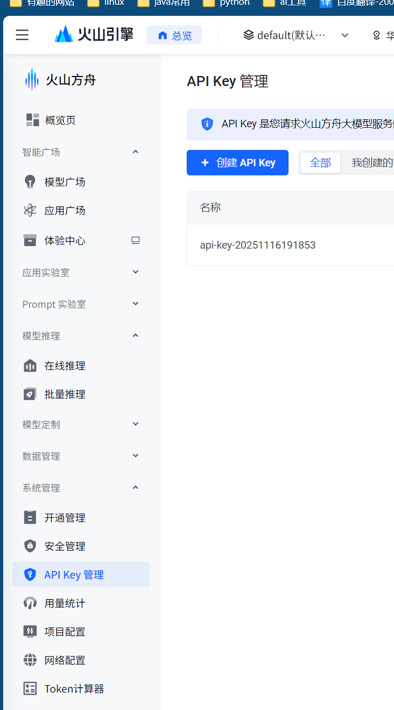

# Claude Code 使用指南

## 📖 目录

- [参考文档](#-参考文档)
- [安装](#-安装)
- [接入国产模型](#-接入国产模型)
- [使用](#-使用)

## 📚 参考文档

- [Claude Code 官方文档](https://www.cnblogs.com/javastack/p/19217578)
- [知乎文档 - Claude Code 使用](https://zhuanlan.zhihu.com/p/1928918331810886674)
- [Claude Code 原理分析](https://www.zhihu.com/question/1910264205526962733/answer/1926068520208273472)
- [Claude Code 技术分析](https://southbridge-research.notion.site/claude-code-an-agentic-cleanroom-analysis)

## 💻 安装

### Windows 下安装

#### 前置要求
1. **安装 Node.js 18.0.0 或以上版本**
2. **安装 Git**
3. **安装 Claude Code**
```bash
npm install -g @anthropic-claude-code
claude --version # 验证安装是否成功
```

#### 常见问题解决
**报错 "claude 找不到命令" 解决方法：**

使用命令查看安装路径：
```bash
npm config get prefix
```

将路径添加到系统环境变量中：

**添加 PATH 的步骤：**
1. 按 `Win + R`，输入 `sysdm.cpl` 回车
2. 点击"高级"选项卡 → "环境变量"
3. 在"系统变量"中找到 `Path`，双击编辑
4. 点击"新建"，添加：`D:\Program Files\GlobalNodeMoudels`
5. 确定保存

## 🔌 接入国产模型

### 豆包模型

#### 获取 API Key
1. 访问 [火山方舟控制台](https://console.volcengine.com/ark/region:ark+cn-beijing/apiKey)
2. 创建并获取 API Key


#### 配置文件设置
在用户目录下创建配置文件：
- **路径**: `C:\Users\18220\.claude\settings.json`

**配置内容**:
```json
{
  "env": {
    "ANTHROPIC_AUTH_TOKEN": "YOUR_API_KEY",
    "ANTHROPIC_BASE_URL": "https://ark.cn-beijing.volces.com/api/compatible",
    "ANTHROPIC_MODEL": "doubao-seed-code-preview-latest",
    "API_TIMEOUT_MS": "3000000",
    "CLAUDE_CODE_DISABLE_NONESSENTIAL_TRAFFIC": 1
  }
}
```

### DeepSeek 模型

#### 获取 API Key
- 访问 [DeepSeek 开放平台](https://platform.deepseek.com/api_keys)
- 创建并获取 API Key

#### 模型说明
- **deepseek-reasoner**: 思考模型
- **deepseek-chat**: 对话模型

#### 配置文件设置
**配置内容**:
```json
{
  "env": {
    "ANTHROPIC_AUTH_TOKEN": "YOUR_API_KEY",
    "ANTHROPIC_BASE_URL": "https://api.deepseek.com/anthropic",
    "ANTHROPIC_MODEL": "deepseek-chat",
    "API_TIMEOUT_MS": "3000000"
  }
}
```

## 🚀 使用

### 命令行使用

1. **进入项目根目录**
```bash
cd /path/to/your/project
```

2. **启动 Claude Code**
```bash
claude
```

### VSCode 插件

1. **安装 Claude Code 插件**
   - 在 VSCode 扩展商店中搜索 "Claude Code"
   - 点击安装

2. **使用方式**
   - 插件会自动加载 Claude 服务
   - 在 VSCode 中直接使用 Claude 进行代码生成和编辑

## 💡 使用技巧

- **项目上下文**: Claude Code 会自动读取当前项目的文件结构
- **代码编辑**: 可以直接让 Claude 修改、重构或优化代码
- **问题解答**: 可以询问编程相关的问题和最佳实践
- **文件操作**: 支持创建、编辑、删除文件等操作

## ⚠️ 注意事项

- 确保 API Key 配置正确
- 检查网络连接是否正常
- 注意 API 调用配额限制
- 配置文件路径要正确

