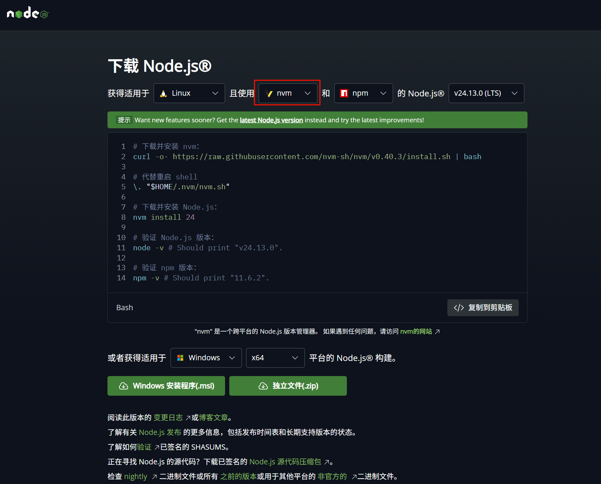
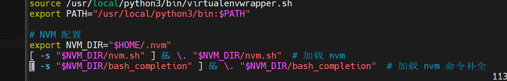
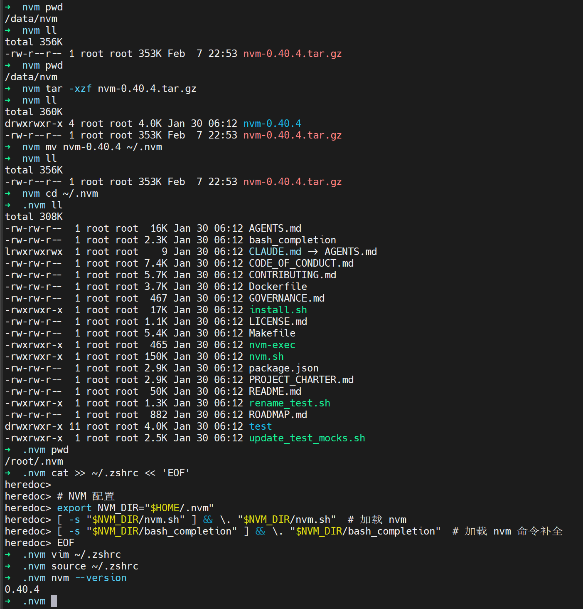
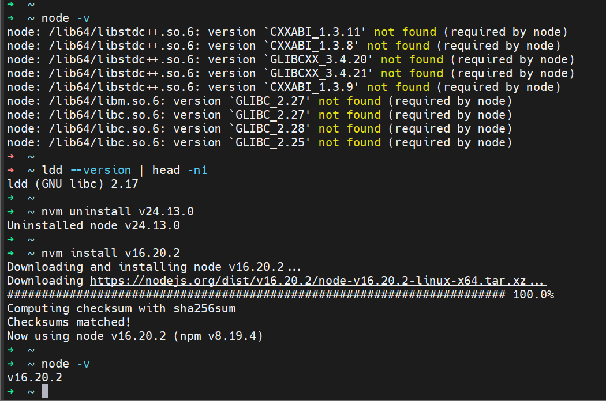
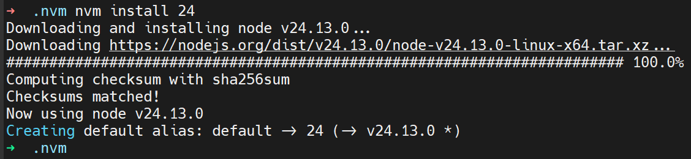

# nodejs
Node.js 是一个开源的跨平台 JavaScript 运行环境。它是几乎任何类型项目都常用的工具！

## 文档
- [Node.js 官方文档](https://nodejs.org/zh-cn/docs)
- [node.js docs](https://nodejs.org/zh-cn/learn/getting-started/introduction-to-nodejs)

## nvm
nvm 是一个 Node.js 版本管理工具。它可以让你在同一台机器上安装和使用多个版本的 Node.js。
nvm 可以从官方仓库下载安装脚本：[nvm 安装脚本](https://github.com/nvm-sh/nvm#installing-and-updating)

### nvm通用安装步骤
发现设置镜像源之后下载nvm还是超时； 因此下载 tar.gz 包手动安装。

1. 下载 tar.gz 包 到本地再上传服务器
2. 解压 tar.gz 包
```bash
# 解压 .tar.gz 压缩包 使用的目录是：/data/nvm
tar -xzf nvm-0.40.4.tar.gz
```
3. 移动解压目录到 ~/.nvm
```bash
# nvm 的标准安装目录是 ~/.nvm（用户专属）或 /opt/nvm（系统共用）。
mv nvm-0.40.4 ~/.nvm
```
4. 配置 Shell 环境变量
```bash
# nvm 需要通过 shell 脚本加载。您需要将加载命令添加到您的 shell 配置文件（如 ~/.bashrc 或 ~/.zshrc）中。
# 编辑配置文件（如果您使用 bash）
cat >> ~/.zshrc << 'EOF'

# NVM 配置
export NVM_DIR="$HOME/.nvm"
[ -s "$NVM_DIR/nvm.sh" ] && \. "$NVM_DIR/nvm.sh"  # 加载 nvm
[ -s "$NVM_DIR/bash_completion" ] && \. "$NVM_DIR/bash_completion"  # 加载 nvm 命令补全
EOF
```
5. 重新加载 shell 配置文件
```bash
source ~/.zshrc
```


6. 设置国内镜像源：
```bash
# 设置国内镜像源
# 将此命令加入 ~/.bashrc 或 ~/.zshrc 文件末尾
echo 'export NVM_NODEJS_ORG_MIRROR=https://npmmirror.com/mirrors/node' >> ~/.zshrc
echo 'export NVM_IOJS_ORG_MIRROR=https://npmmirror.com/mirrors/iojs' >> ~/.zshrc

# 使配置生效
source ~/.zshrc
```
>注意：
由于centos7不支持最新版本nodejs, 因此安装 安装 Node.js v16 的最后一个 LTS 版本 (兼容 CentOS 7 的 glibc 2.17)
```bash
nvm install 16.20.0
```


### 使用 nvm
安装完成后，你可以使用 nvm 命令来安装和管理 Node.js 版本。 
nvm常用命令如下：
- 安装最新版本的 Node.js
```bash
# 下载并安装 Node.js：
nvm install 24
```


- 切换 Node.js 版本
```bash
nvm use node
```
- 查看已安装的 Node.js 版本
```bash
nvm ls
```

- 设置别名
```bash
# 设置别名
nvm alias my_alias v14.4.0
```

- nvm help

## npm
npm 是 Node.js 的包管理器。它可以让你安装和管理 Node.js 模块。
- [node.js 官方文档 - npm 包管理器](https://nodejs.org/zh-cn/learn/getting-started/an-introduction-to-the-npm-package-manager)

npm常用命令如下：
- 安装模块
```bash
npm install <module-name>
```
- 全局安装模块
```bash
npm install -g <module-name>
```
- 查看已安装的模块
```bash
npm ls
```
- 卸载模块
```bash
npm uninstall <module-name>
```
- 更新模块
```bash
npm update <module-name>
```
- 初始化项目
```bash
npm init
```
- 安装项目依赖
```bash
npm install
```
- 发布项目
```bash
npm publish
```

