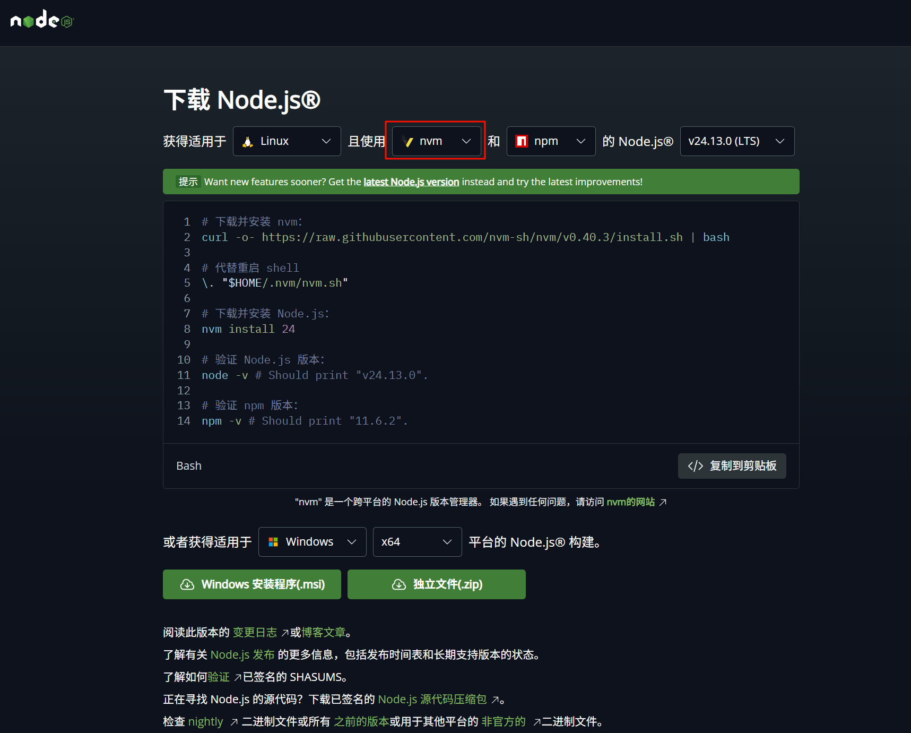
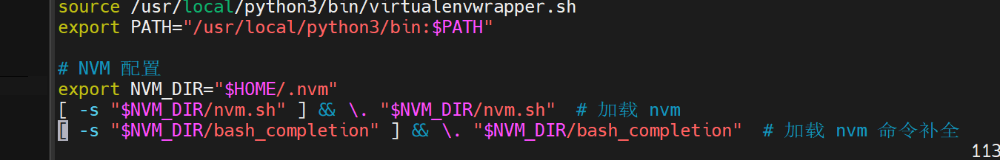
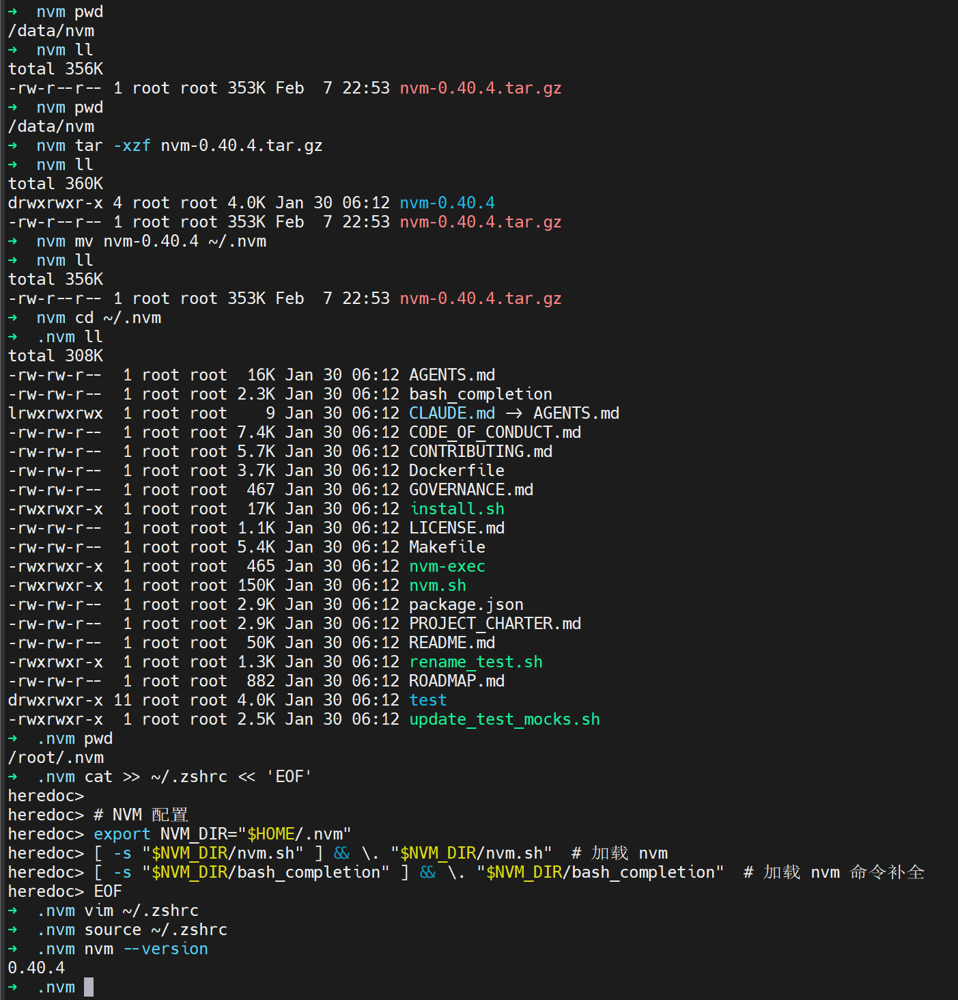
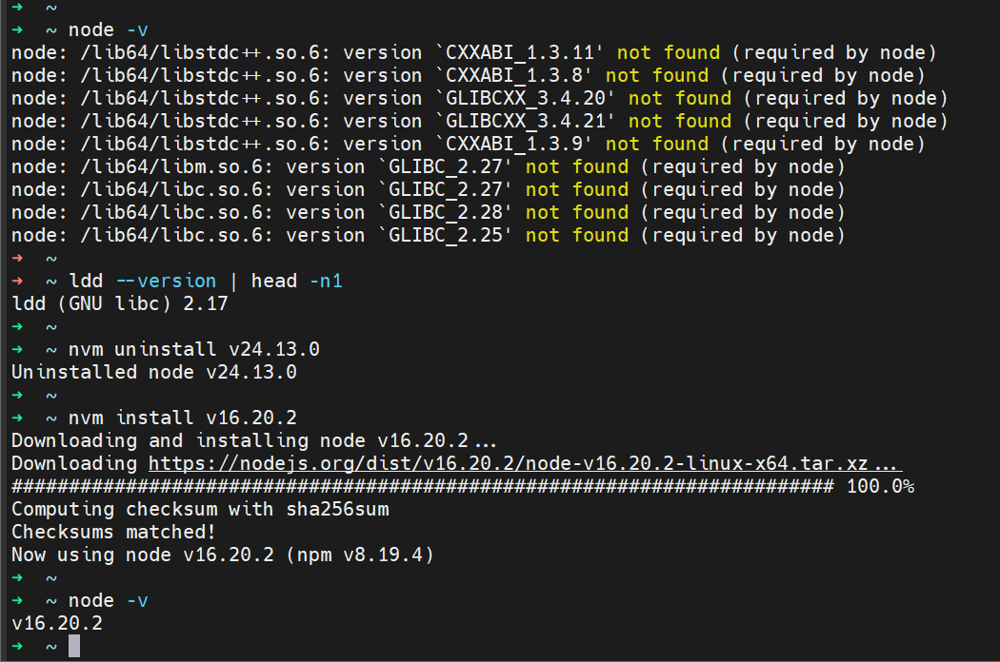
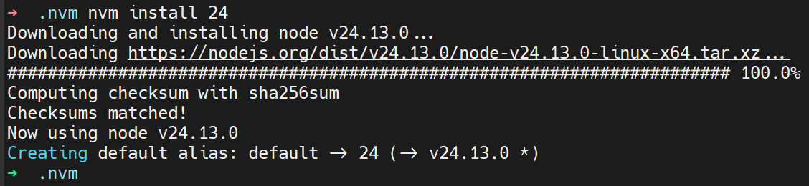

# nodejs
Node.js 是一个开源的跨平台 JavaScript 运行环境。它是几乎任何类型项目都常用的工具！

## 文档
- [Node.js 官方文档](https://nodejs.org/zh-cn/docs)
- [node.js docs](https://nodejs.org/zh-cn/learn/getting-started/introduction-to-nodejs)

## nvm
nvm 是一个 Node.js 版本管理工具。它可以让你在同一台机器上安装和使用多个版本的 Node.js。
nvm 可以从官方仓库下载安装脚本：[nvm 安装脚本](https://github.com/nvm-sh/nvm#installing-and-updating)

### nvm安装步骤--linux
发现设置镜像源之后下载nvm还是超时； 因此下载 tar.gz 包手动安装。

1. 下载 tar.gz 包 到本地再上传服务器
2. 解压 tar.gz 包
```bash
# 解压 .tar.gz 压缩包 使用的目录是：/data/nvm
tar -xzf nvm-0.40.4.tar.gz
```
3. 移动解压目录到 ~/.nvm
```bash
# nvm 的标准安装目录是 ~/.nvm（用户专属）或 /opt/nvm（系统共用）。
mv nvm-0.40.4 ~/.nvm
```
4. 配置 Shell 环境变量
```bash
# nvm 需要通过 shell 脚本加载。您需要将加载命令添加到您的 shell 配置文件（如 ~/.bashrc 或 ~/.zshrc）中。
# 编辑配置文件（如果您使用 bash）
cat >> ~/.zshrc << 'EOF'

# NVM 配置
export NVM_DIR="$HOME/.nvm"
[ -s "$NVM_DIR/nvm.sh" ] && \. "$NVM_DIR/nvm.sh"  # 加载 nvm
[ -s "$NVM_DIR/bash_completion" ] && \. "$NVM_DIR/bash_completion"  # 加载 nvm 命令补全
EOF
```
5. 重新加载 shell 配置文件
```bash
source ~/.zshrc
```


6. 设置国内镜像源：
```bash
# 设置国内镜像源
# 将此命令加入 ~/.bashrc 或 ~/.zshrc 文件末尾
echo 'export NVM_NODEJS_ORG_MIRROR=https://npmmirror.com/mirrors/node' >> ~/.zshrc
echo 'export NVM_IOJS_ORG_MIRROR=https://npmmirror.com/mirrors/iojs' >> ~/.zshrc

# 使配置生效
source ~/.zshrc
```
>注意：
由于centos7不支持最新版本nodejs, 因此安装 安装 Node.js v16 的最后一个 LTS 版本 (兼容 CentOS 7 的 glibc 2.17)
```bash
nvm install 16.20.0
```


### 使用 nvm
安装完成后，你可以使用 nvm 命令来安装和管理 Node.js 版本。 
nvm常用命令如下：
- 安装最新版本的 Node.js
```bash
# 下载并安装 Node.js：
nvm install 24
```


- 切换 Node.js 版本
```bash
nvm use node
```
- 查看已安装的 Node.js 版本
```bash
nvm ls
```

- 设置别名
```bash
# 设置别名
nvm alias my_alias v14.4.0
```

- nvm help

## npm
npm 是 Node.js 的包管理器。它可以让你安装和管理 Node.js 模块。
- [node.js 官方文档 - npm 包管理器](https://nodejs.org/zh-cn/learn/getting-started/an-introduction-to-the-npm-package-manager)

npm常用命令如下：
- 安装模块
```bash
npm install <module-name>
```
- 全局安装模块
```bash
npm install -g <module-name>
```
- 查看已安装的模块
```bash
npm ls
```
- 卸载模块
```bash
npm uninstall <module-name>
```
- 更新模块
```bash
npm update <module-name>
```
- 初始化项目
```bash
npm init
```
- 安装项目依赖
```bash
npm install
```
- 发布项目
```bash
npm publish
```

### 安装 nvm-windows

nvm-windows 是 Windows 系统上的 Node.js 版本管理工具，使用它可以更方便地管理多个 Node.js 版本。

1. **下载 nvm-windows 安装包**
   - 访问 [nvm-windows GitHub 仓库](https://github.com/coreybutler/nvm-windows/releases)
   - 下载最新的 `nvm-setup.exe` 安装文件

2. **运行安装程序**
   - 双击 `nvm-setup.exe` 文件
   - 按照安装向导的提示完成安装
   - 可以选择默认安装路径，也可以自定义路径

3. **验证安装结果**
```bash
nvm version
```

4. **配置国内镜像源（可选但推荐）**
   - 编辑 nvm 安装目录下的 `settings.txt` 文件
   - 添加以下内容：
```
node_mirror: https://npmmirror.com/mirrors/node/
npm_mirror: https://npmmirror.com/mirrors/npm/
```

5. **使用 nvm-windows 安装 Node.js**
```bash
# 安装最新版本
nvm install latest

# 安装 LTS 版本
nvm install lts

# 安装特定版本
nvm install 24.0.0
```

6. **切换 Node.js 版本**
```bash
nvm use 24.0.0
```
### 卸载 nvm-windows

如果需要卸载 nvm-windows，可以使用以下命令：
```bash
# 卸载 nvm-windows
nvm uninstall
```

### 升级nodejs

在 Windows 上升级 Node.js 有两种主要方法：使用 nvm-windows 或直接下载安装包升级。

#### 方法一：使用 nvm-windows 升级（推荐）

1. **查看当前安装的 Node.js 版本**
```bash
nvm list
```

2. **安装最新版本的 Node.js**
```bash
nvm install latest
```

3. **安装特定版本的 Node.js**
```bash
# 安装特定版本，例如 v24.0.0
nvm install 24.0.0
```

4. **切换到新安装的版本**
```bash
nvm use 24.0.0
```

5. **验证升级结果**
```bash
node -v
npm -v
```

#### 方法二：直接下载安装包升级

1. **访问 Node.js 官方网站**
   - 打开 [Node.js 官方网站](https://nodejs.org/zh-cn/)
   - 下载最新的 Windows 安装包（LTS 版本推荐）

2. **运行安装程序**
   - 双击下载的 `.msi` 文件
   - 按照安装向导的提示完成安装
   - 安装程序会自动覆盖旧版本

3. **验证升级结果**
```bash
node -v
npm -v
```

#### 升级 npm

无论使用哪种方法升级 Node.js，都可以单独升级 npm 到最新版本：
```bash
npm install -g npm@latest
```

#### 注意事项

- 使用 nvm-windows 可以同时管理多个 Node.js 版本，便于在不同项目间切换
- 直接安装包升级会覆盖当前版本，适用于只需要一个版本的用户
- 升级前建议备份重要的项目依赖和配置
- 某些旧项目可能依赖特定版本的 Node.js，升级前请确认兼容性

### 卸载 nvm-windows

当你不再需要 nvm-windows 时，可以按照以下步骤卸载它：

1. **关闭所有命令提示符窗口**
   - 确保没有正在使用 nvm 或 Node.js 的终端窗口

2. **卸载 nvm-windows**
   - 打开 "控制面板" → "程序和功能"
   - 找到 "nvm-windows" 并点击 "卸载"
   - 按照卸载向导的提示完成卸载过程

3. **删除 nvm 安装目录**
   - 手动删除 nvm 的安装目录（例如 "C:\nvm" 或 "D:\nvm"）
   - 确保删除所有相关文件和文件夹

4. **删除环境变量**
   - 打开 "系统属性" → "高级" → "环境变量"
   - 删除系统变量中的 `NVM_HOME` 和 `NVM_SYMLINK`
   - 从系统 PATH 中删除 `%NVM_HOME%` 和 `%NVM_SYMLINK%` 相关条目

5. **删除符号链接**
   - 删除 `NVM_SYMLINK` 指向的目录（通常为 "C:\Program Files\nodejs"）
   - 注意：如果该目录是实际的 Node.js 安装（非符号链接），请谨慎操作

6. **验证卸载**
   - 打开新的命令提示符窗口
   - 执行 `nvm version` 命令
   - 如果显示 "nvm 不是内部或外部命令"，则卸载成功

### 故障排除